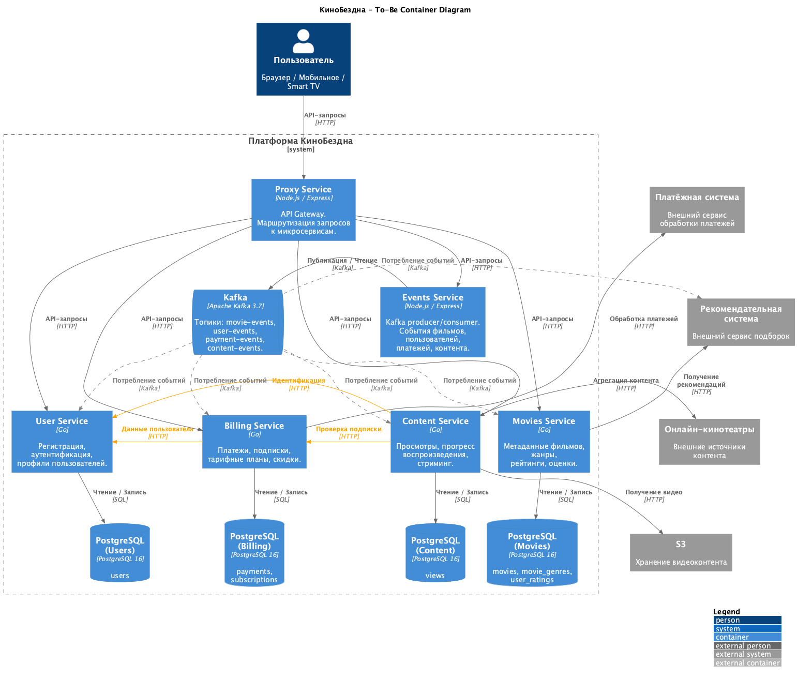
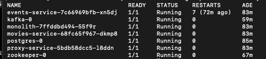
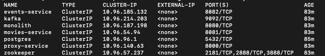
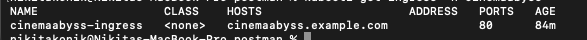
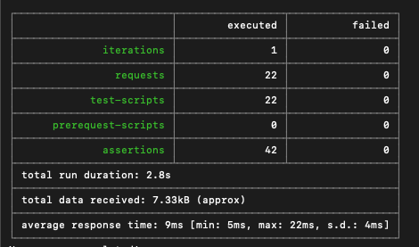
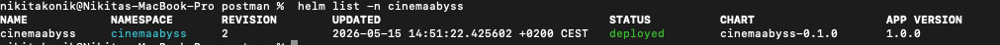

# Задание 1

## Архитектура To-Be: полная декомпозиция монолита

Монолит полностью устранён. Все домены разнесены по отдельным микросервисам, каждый со своей базой данных (паттерн database-per-service).

### Микросервисы

| Сервис | Технология | Домен | Данные |
|--------|-----------|-------|--------|
| **User Service** | Go | Пользователи, аутентификация, профили | `users` |
| **Billing Service** | Go | Платежи, подписки, тарифные планы, скидки | `payments`, `subscriptions` |
| **Content Service** | Go | Просмотры, прогресс воспроизведения, стриминг | `views` |
| **Movies Service** | Go | Метаданные фильмов, жанры, рейтинги, оценки | `movies`, `movie_genres`, `user_ratings` |
| **Events Service** | Node.js | Kafka producer/consumer, шина событий | — |
| **Proxy Service** | Node.js | API Gateway, маршрутизация | — |

### Обоснование разделения (Bounded Contexts)

- **User Service** — управление идентификацией и профилями пользователей. Независимый жизненный цикл: регистрация, аутентификация, обновление профиля. Другие сервисы обращаются к нему по `user_id`.
- **Billing Service** — платежи и подписки объединены, т.к. это один bounded context «денежные отношения с пользователем». Платёж создаётся при оформлении подписки, подписка продлевается при успешном платеже. Сервис взаимодействует с внешней платёжной системой.
- **Content Service** — отвечает за потребление контента: история просмотров, прогресс воспроизведения (где пользователь остановился). Агрегирует видеопоток из внешних онлайн-кинотеатров. Хранит видеоконтент в S3.
- **Movies Service** — каталог: метаданные фильмов, жанры, рейтинги и пользовательские оценки. Взаимодействует с внешней рекомендательной системой.
- **Events Service** — MVP шины событий на Kafka. В целевой архитектуре consumer-ы будут в самих сервисах (пунктирные стрелки на диаграмме).

### Межсервисные зависимости

- **Content Service → User Service** — идентификация пользователя при просмотре контента.
- **Content Service → Billing Service** — проверка активной подписки перед предоставлением доступа к контенту.
- **Billing Service → User Service** — привязка платежей и подписок к пользователю.

Синхронные вызовы (HTTP) используются там, где нужен немедленный ответ (проверка подписки). Асинхронные уведомления (Kafka) — для событий, не требующих немедленной реакции (платёж прошёл, подписка истекла).

### Инфраструктурные решения

- **Kafka 3.7 (KRaft)** — без ZooKeeper. Режим KRaft убирает зависимость от отдельного кластера ZK, упрощает эксплуатацию. Топики: `movie-events`, `user-events`, `payment-events`, `content-events`.
- **Database-per-service** — каждый сервис владеет своей PostgreSQL-базой. Это обеспечивает независимое масштабирование, автономные деплои и изоляцию данных между доменами.
- **Proxy Service** — единая точка входа для всех клиентов (браузер, мобильное, Smart TV). Маршрутизирует запросы к соответствующим микросервисам.

Файлы: [c4-container-diagram.puml](docs/c4-container-diagram.puml)

# Задание 2

### 1. Proxy

Proxy-сервис реализован на Node.js (Express + http-proxy-middleware) в [`src/microservices/proxy/`](src/microservices/proxy/).

Маршрутизация:
- `GET /health` — возвращает "Strangler Fig Proxy is healthy"
- `/api/events/*` — проксируется в Events Service
- `/api/movies*` — по проценту `MOVIES_MIGRATION_PERCENT` уходит в Movies Service или Monolith
- Остальные пути — проксируются в Monolith

Файлы: [index.js](src/microservices/proxy/index.js), [Dockerfile](src/microservices/proxy/Dockerfile), [package.json](src/microservices/proxy/package.json)

### 2. Kafka

Events-сервис реализован на Node.js (Express + kafkajs) в [`src/microservices/events/`](src/microservices/events/).

API:
- `GET /api/events/health` — health check
- `POST /api/events/movie` — публикует событие в топик `movie-events`
- `POST /api/events/user` — публикует событие в топик `user-events`
- `POST /api/events/payment` — публикует событие в топик `payment-events`

Consumer в фоне читает все 3 топика и логирует сообщения.

Файлы: [index.js](src/microservices/events/index.js), [Dockerfile](src/microservices/events/Dockerfile), [package.json](src/microservices/events/package.json)

# Задание 3

### CI/CD

В [`docker-build-push.yml`](.github/workflows/docker-build-push.yml) добавлены шаги сборки и пуша для Events Service и Proxy Service. Ветка `cinema` добавлена в триггер.

### Proxy в Kubernetes

- [`proxy-service.yaml`](src/kubernetes/proxy-service.yaml) — Deployment (порт 8000, health-проба `/health`) + Service (ClusterIP)
- [`events-service.yaml`](src/kubernetes/events-service.yaml) — Deployment (порт 8082, `KAFKA_BROKERS=kafka:9092`, health-проба `/api/events/health`) + Service (ClusterIP)
- [`ingress.yaml`](src/kubernetes/ingress.yaml) — `/api/events` → events-service:8082, `/` → proxy-service:8000
- [`configmap.yaml`](src/kubernetes/configmap.yaml) — добавлен `EVENTS_SERVICE_URL`
- Образы [`monolith.yaml`](src/kubernetes/monolith.yaml), [`movies-service.yaml`](src/kubernetes/movies-service.yaml) — пути обновлены на `ghcr.io/siritoskon/architecture-cinemaabyss/*`

#### Скриншоты

# Задание 4

- [`values.yaml`](src/kubernetes/helm/values.yaml) — все образы обновлены на `ghcr.io/siritoskon/architecture-cinemaabyss/*`
- [`proxy-service.yaml`](src/kubernetes/helm/templates/services/proxy-service.yaml) — Deployment + Service по паттерну monolith.yaml
- [`events-service.yaml`](src/kubernetes/helm/templates/services/events-service.yaml) — Deployment + Service по паттерну movies-service.yaml
- [`configmap.yaml`](src/kubernetes/helm/templates/configmap.yaml) — добавлен `EVENTS_SERVICE_URL`, исправлен URL movies-service

#### Скриншоты

